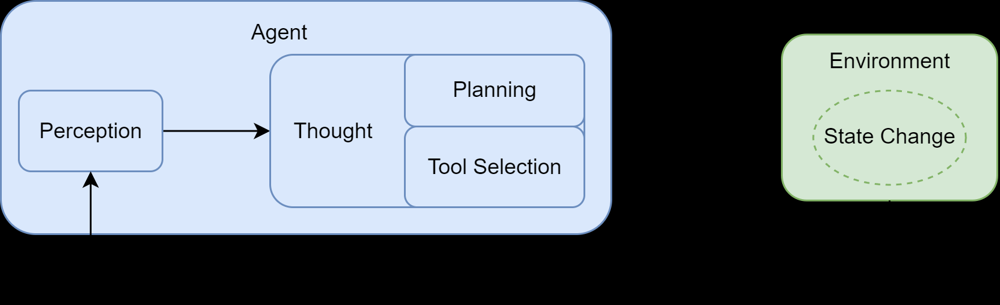

智能体（Agent）
在人工智能领域，智能体被定义为任何能够通过传感器（Sensors）感知其所处环境（Environment），并自主地通过执行器（Actuators）采取行动（Action）以达成特定目标的实体。

这个循环主要包含以下几个相互关联的阶段：

1. **感知 (Perception)**：这是循环的起点。智能体通过其传感器（例如，API 的监听端口、用户输入接口）接收来自环境的输入信息。这些信息，即观察 (Observation)，既可以是用户的初始指令，也可以是上一步行动所导致的环境状态变化反馈。
2. **思考 (Thought)**：接收到观察信息后，智能体进入其核心决策阶段。对于 LLM 智能体而言，这通常是由大语言模型驱动的内部推理过程。如图所示，“思考”阶段可进一步细分为两个关键环节：
   + **规划 (Planning)**：智能体基于当前的观察和其内部记忆，更新对任务和环境的理解，并制定或调整一个行动计划。这可能涉及将复杂目标分解为一系列更具体的子任务。
   + **工具选择 (Tool Selection)**：根据当前计划，智能体从其可用的工具库中，选择最适合执行下一步骤的工具，并确定调用该工具所需的具体参数。
3. **行动 (Action)**：决策完成后，智能体通过其执行器（Actuators）执行具体的行动。这通常表现为调用一个选定的工具（如代码解释器、搜索引擎 API），从而对环境施加影响，意图改变环境的状态。

行动并非循环的终点。智能体的行动会引起环境 (Environment) 的状态变化 (State Change)，环境随即会产生一个新的观察 (Observation) 作为结果反馈。这个新的观察又会在下一轮循环中被智能体的感知系统捕获，形成一个持续的“感知-思考-行动-观察”的闭环。智能体正是通过不断重复这一循环，逐步推进任务，从初始状态向目标状态演进。