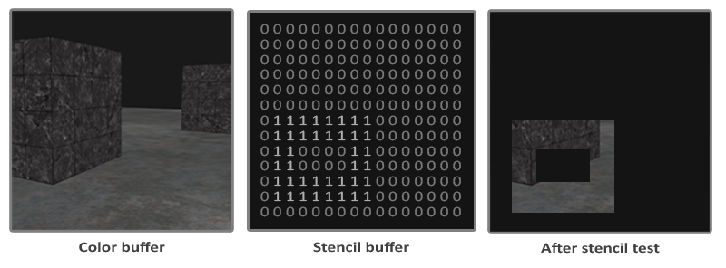

# 模板测试 Stencil testing


## 模板测试的时机

光栅化 => 模板测试 => 深度测试



```js
gl.enable(gl.STENCIL_TEST); // 启用模板测试
gl.clear(gl.COLOR_BUFFER_BIT | gl.DEPTH_BUFFER_BIT | gl.STENCIL_BUFFER_BIT); // 清除模板缓冲区

```

## gl.stencilMask 设置模板掩码

`gl.stencilMask(0xFF)` 用于设置模板掩码，控制写入模板缓冲区的位
0xFF 表示允许写入模板缓冲区的所有位（即8个位都被启用）
0x00 表示禁用所有位的写入


模板缓冲区为每一个像素设置了一个整数(0-255)的数字用于存储模板值
这个模板值与设置的掩码值按位与之后作为新的模板值写入
最后再根据后续的具体模板测试的设置来对比模板值来决定这个片段是通过还是被丢弃

## gl.stencilOp 设置模板操作

`gl.stencilOp(GLenum sfail， GLenum dpfail， GLenum dppass)`

`sfail`：模板测试失败时要执行的操作。
`dpfail`：如果模板测试通过，但深度测试失败，则要执行的操作。
`dppass`：如果模板和深度测试都通过，则要执行的操作。


| 行动           | 描述                                                   |
| :------------- | :----------------------------------------------------- |
| `gl.KEEP`      | 将保留当前存储的模板值。默认值                          |
| `gl.ZERO`      | 模板值设置为0                                       |
| `gl.REPLACE`   | 模板值将替换为使用 `gl.stencilFunc` 设置的参考值。        |
| `gl.INCR`      | 如果模板值低于最大值，则模板值将增加。1                |
| `gl.INCR_WRAP` | 与`gl.INCR`相同，但在超过最大值时将其包装回。gl.INCR0          |
| `gl.DECR`      | 如果模板值高于最小值，则模板值将减少。1                |
| `gl.DECR_WRAP` | 与`gl.DECR`相同，但如果最终低于0 ，则将其包装为最大值。 |
| `gl.INVERT`    | 按位反转当前模板缓冲区值。                             |

## gl.stencilFunc 设置模板函数

`gl.stencilFunc(GLenum func， GLint ref， GLuint mask)` 描述 OpenGL 是否应该根据模板缓冲区的内容传递或丢弃片段

`func`：设置模板测试的测试函数，用于确定片段是通过还是被丢弃。可能的选项有。`gl.NEVER`, `gl.LESS`, `gl.LEQUAL`, `gl.GREATER`, `gl.GEQUAL`, `gl.EQUAL`, `gl.NOTEQUAL` and `gl.ALWAYS`.
`ref`：指定模板测试的参考值。将模板缓冲区的内容与此值进行比较。
`mask`：指定一个掩码，在测试比较它们之前，该掩码同时使用参考值和存储的模板值进行编辑。最初设置所有位为1, 掩码0xFF表示所有位都参与比较

```js
gl.stencilFunc(gl.EQUAL, 1, 0xFF);
// 每当片段的模板值等于参考值 1 时，该片段就会通过测试并被绘制，否则将被丢弃
```

### 对象轮廓 Object outlining


```js
gl.enable(gl.DEPTH_TEST);
gl.stencilOp(gl.KEEP, gl.KEEP, gl.REPLACE);

gl.clear(gl.COLOR_BUFFER_BIT | gl.DEPTH_BUFFER_BIT | gl.STENCIL_BUFFER_BIT);

gl.stencilMask(0x00);// 关闭对模板缓冲区的写入
normalShader.use();
drawFloor();

gl.stencilFunc(gl.ALWAYS, 1, 0xFF);// 总是通过 无论参考值和掩码是多少 
gl.stencilMask(0xFF); // 开启模板缓冲区的写入
drawTwoContainers(); // 这里再进行容器的绘制的时候 模板缓冲区也会被相应更新 具体来说 有绘制的区域模板值会被更新成1 否则为0

gl.stencilFunc(gl.NOTEQUAL, 1, 0xFF); // 模板值不等于1时通过测试
gl.stencilMask(0x00); // 关闭模板缓冲区的写入
gl.disable(gl.DEPTH_TEST); // 避免轮廓被地板遮挡 先暂时关闭深度测试
shaderSingleColor.use();
drawTwoScaledUpContainers(); // 绘制放大的容器，覆盖原来的容器区域，但只在模板值不等于1的区域绘制，从而形成轮廓效果

// 恢复模板缓冲区的写入，设置模板函数为始终通过，并启用深度测试，恢复正常的绘制状态
gl.stencilMask(0xFF);
gl.stencilFunc(gl.ALWAYS, 1, 0xFF); 
gl.enable(gl.DEPTH_TEST);

```