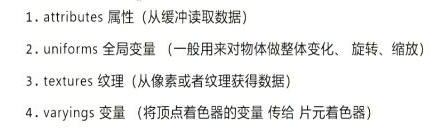

# gpu渲染原理

## gpu渲染流程


## 渲染过程


## 顶点着色器


```glsl
attribute vec3 position;
void main(){
    gl_Position = vec4(position, 1);
}
```

### 裁剪空间

顶点着色器中的坐标只能时裁剪空间里的坐标 即区间[-1, 1]之间


### 数据

顶点着色器的数据来源


### 图元装配与光栅化

描述各种图形元素的函数叫做**图元**, 描述集合元素的称为几何图元(点,线段或多边形)

**图元装配**是指将顶点颜色纹理等内容组装成为一个可渲染的多边形的过程

**光栅化**是指通过图元装配生成的多边形,计算像素并填充,剔除不可见的部分, 裁剪掉不在可视范围内的部分. 最终生成可见的带有颜色数据的图形并绘制

图元装配


