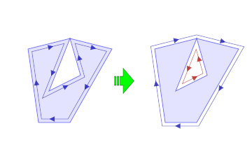
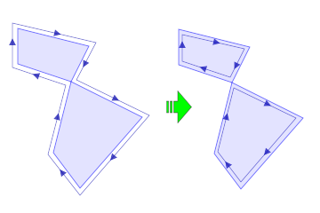
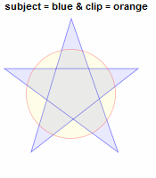
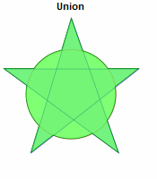
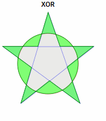
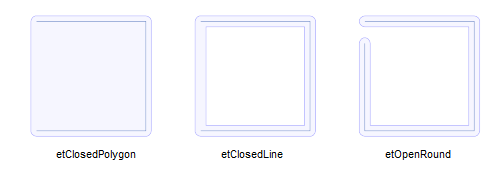
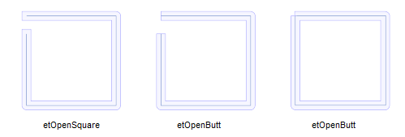
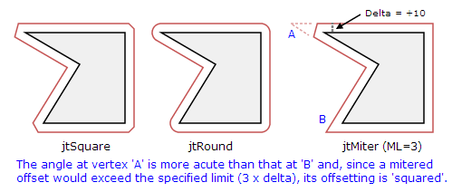

## 术语介绍

### clipping 剪裁

通常是指从一组二维几何形状中移除（剪裁）矩形“剪裁”窗口之外的那些部分的过程。这可以通过将主体路径（直线和多边形）与剪裁矩形相交来实现。
从更一般的意义上讲，剪裁窗口不必是矩形，而是可以是任何类型的多边形，甚至是多个多边形。
此外，虽然剪裁通常是指交集运算，但在本文档中，它将引用四个布尔运算（交集、并集、差分和互斥或）中的任何一个。

### Path(路径) / Contour(轮廓)

是一个有序的顶点序列，用于定义单个几何轮廓，该几何轮廓可以是直线（开放路径）也可以是多边形（闭合路径）。

### Line(线) / polyline(折线)

包含 2 个或更多顶点的开放路径。

### Polygon 多边形

从一般意义上讲，多边形是一个二维区域，由外部封闭路径边界，包含零到多个“孔”。但是，在本文档中，多边形指的是已知已闭合的路径。

### Hole 孔

孔是多边形内不属于多边形的闭合区域。形成孔外部边界的多边形称为孔多边形。

### 多边形填充规则

与路径列表一起，填充规则定义了由多边形内部（即在图形显示中“填充”）和外部路径边界的区域。

## ClipperBase

### ClipperBase.AddPath

`Boolean AddPath(Path pg, PolyType polyType, Boolean closed);`

`Boolean AddPaths(Paths ppg, PolyType polyType, Boolean closed);`

主体路径 `ClipperLib.PolyType.ptSubject`
剪切路径 `ClipperLib.PolyType.ptSubject`

可以将任意数量的主体路径和剪切路径添加到 clipping task 中

主体路径可以是开放的 也可以是闭合的 但剪切路径必须始终是闭合的

路径坐标范围： 路径坐标必须介于 ± 4503599627370495 （sqrt（2^106 -1）/2） 之间，
否则在尝试将路径添加到 Clipper 对象时将引发范围错误。如果坐标可以保持在 ± 47453132 （sqrt（2^53 -1）/2） 之间，
则可以通过避免大整数数学运算来实现更大范围内的性能提升（约 40-50%）。

返回值： 如果路径为空或几乎为空，则该函数将返回 false。在以下情况下，路径几乎为空：

它的顶点少于 2 个。
它有 2 个顶点，但不是开放路径
顶点都是共线性的，它不是一条开放的路径

```js
var cpr = new ClipperLib.Clipper();
var path = [
  { X: 10, Y: 10 },
  { X: 110, Y: 10 },
  { X: 110, Y: 110 },
  { X: 10, Y: 110 },
];
cpr.AddPath(path, ClipperLib.PolyType.ptSubject, true); //
//剪切路径必须始终是闭合的
```

### ClipperBase.Clear()

`void Clear();`

Clear 方法删除任何现有的主体和裁剪多边形，允许将 Clipper 对象重用于不同多边形集上的裁剪操作。

### Clipper

Clipper 类封装了对多边形（交集、并集、差分和 XOR）的布尔运算，也称为多边形裁剪。

### ClipperLib.Clipper()

`Clipper ClipperLib.Clipper(InitOptions initOptions = 0);`

Clipper 构造函数创建 Clipper 类的实例。一个或多个 InitOptions 可以作为参数传递以设置相应的属性。(这些属性仍然可以后续重设)

```js
var cpr = new ClipperLib.Clipper();
// or
var cpr = new ClipperLib.Clipper(
  ClipperLib.Clipper.ioStrictlySimple | ClipperLib.Clipper.ioPreserveCollinear
);
// or
var cpr = new ClipperLib.Clipper(2 | 4);
```

### ClipperLib.Clipper.Area()

`Number Area(Path poly)` 返回多边形的面积

### ClipperLib.Clipper.CleanPolygon()

`Path CleanPolygon(Path path, Number distance)` 删除一些顶点, 防止因顶点太近和/或微自插曲而导致的失真
`Paths CleanPolygons(Paths polys, Number distance)` 与上面类似

### ClipperLib.Clipper.ClosedPathsFromPolyTree()

`Paths ClosedPathsFromPolyTree(PolyTree polytree)`

从 PolyTree 结构中筛选出打开的路径，并仅返回 Paths 结构中的闭合路径

### ClipperLib.Clipper.Execute()

```js
Boolean Execute(ClipType clipType,
  Paths solution,
  PolyFillType subjFillType,
  PolyFillType clipFillType);
```

用例

```js
function DrawPolygons(paths, color) {
  /* ... */
}

function Main(args) {
  var subj = [
    [
      { X: 10, Y: 10 },
      { X: 110, Y: 10 },
      { X: 110, Y: 110 },
      { X: 10, Y: 110 },
    ],
    [
      { X: 20, Y: 20 },
      { X: 20, Y: 100 },
      { X: 100, Y: 100 },
      { X: 100, Y: 20 },
    ],
  ];
  var clip = [
    [
      { X: 50, Y: 50 },
      { X: 150, Y: 50 },
      { X: 150, Y: 150 },
      { X: 50, Y: 150 },
    ],
    [
      { X: 60, Y: 60 },
      { X: 60, Y: 140 },
      { X: 140, Y: 140 },
      { X: 140, Y: 60 },
    ],
  ];
  DrawPolygons(subj, 0x8033ffff);
  DrawPolygons(clip, 0x80ffff33);

  var solution = new ClipperLib.Paths();
  var c = new ClipperLib.Clipper();
  c.AddPaths(subj, ClipperLib.PolyType.ptSubject, true);
  c.AddPaths(clips, ClipperLib.PolyType.ptClip, true);
  c.Execute(ClipperLib.ClipType.ctIntersection, solution);

  DrawPolygons(solution, 0x40808080);
}
Main();
```

### ClipperLib.Clipper.GetBounds()

`IntRect GetBounds(Paths paths);`

此方法返回路径的轴对齐边界矩形。

### ClipperLib.Clipper.OpenPathsFromPolyTree()

`Paths OpenPathsFromPolyTree(PolyTree polytree)`

从 PolyTree 结构中筛选出闭合路径，并仅返回 Paths 结构中的开放路径

### ClipperLib.Clipper.Orientation()

`Boolean Orientation(Path poly)`

如果多边形面积为 >=0，则返回 true。

方向仅对封闭路径重要。鉴于顶点是按特定顺序声明的，则方向是指这些顶点围绕闭合路径前进的方向（顺时针或逆时针）

### ClipperLib.Clipper.PointInPolygon()

`Number PointInPolygon(IntPoint pt, Path poly)`

如果为 false，则返回 0，如果 pt 在 poly 上，则返回 -1，如果 pt 在 poly 内，则返回 +1

### ClipperLib.Clipper.PolyTreeToPaths()

`Paths PolyTreeToPaths(PolyTree polytree)`

将 PolyTree 结构转换为 Paths 结构

### ClipperLib.Clipper.ReversePath()

`void Path.reverse()` 反转路径中的顶点顺序（以及方向）
`void Path.reversePaths()` 反转每个包含路径中的顶点顺序（以及方向）

### ClipperLib.Clipper.SimplifyPolygon

`Paths SimplifyPolygon(Path poly, PolyFillType fillType = PolyFillType.pftEvenOdd)`
`Paths SimplifyPolygons(Paths polys, PolyFillType fillType = PolyFillType.pftEvenOdd)`

从提供的多边形中删除自交集（通过使用指定的 PolyFillType 执行布尔并集运算）。

具有不连续重复顶点（即“接触”）的多边形将被拆分为两个多边形。

### ClipperLib.Clipper.PreserveCollinear

默认情况下，当输入多边形（主体或裁剪）中的三个或更多顶点共线时，Clipper 对象会在裁剪之前删除“内部”顶点。启用后，PreserveCollinear 属性将阻止此默认行为

### ClipperLib.Clipper.ReverseSolution

当此属性设置为 true 时，在 Execute() 方法的求解参数中返回的多边形将具有与其法线方向相反的方向。

### ClipperLib.Clipper.StrictlySimple

简单多边形是不自相交的多边形。即边之间没有交叉。
弱简单多边形是包含“接触”顶点或“接触”边的简单多边形。顶点可能重合, 但边并未相交. 两个边可能重合但他们不是同一条边.
严格简单多边形是不包含“接触”顶点或“接触”边的简单多边形。

如果顶点共享相同的坐标（并且不相邻），则它们会“接触”。如果一条边的一端顶点与另一条边（不包括其相邻边）接触另一条边，
或者如果它们共线且重叠（包括相邻边），则该边与另一条边接触。

通过裁剪操作返回的多边形（参见 Clipper.Execute（））应始终是简单多边形。启用 StrictlySimply 属性后，
返回的多边形将严格简单，否则它们可能弱简单。确保多边形严格简单，因此默认情况下禁用此属性，计算成本很高。





在上图中，两个示例显示了弱简单多边形被分解为两个严格简单多边形。（带箭头的轮廓旨在帮助可视化顶点顺序。

### ClipperLib.ClipType

鉴于主体和裁剪多边形画笔的“填充”由它们的顶点和各自的填充规则定义，因此可以将四个布尔运算应用于多边形以定义新的填充区域：

AND（交点） - 创建同时填充主体和裁剪多边形的区域 只生成交集区域
OR （union） - 创建填充主体或裁剪多边形（或两者）的区域 生成并集区域
NOT （差异） - 创建填充主题多边形的区域，但填充剪辑 \* 多边形的区域除外 只生成差集区域
异或（互斥或） - 创建填充主体或裁剪多边形的区域，但不创建同时填充两者的区域 只生成并集减去交集的区域







### ClipperLib.EndType

EndType 枚举器有 5 个值：

etOpenSquare：两端是方形的，并扩展了三角形单元
etOpenRound：两端是四舍五入和扩展的三角单元
etOpenButt：两端是方形的，没有延伸。
etClosedLine：使用 JoinType 值和填充为折线的路径连接端
etClosedPolygon：使用 JoinType 值连接端点，并将路径填充为多边形 etOpenSingle：在单个方向上偏移打开路径。计划在未来更新。
注： 对于 etClosedPolygon 和 etClosedLine 类型，无论路径中的第一个顶点和最后一个顶点是否匹配，路径闭包都将相同。





### ClipperLib.IntPoint

IntPoint 结构用于表示 Clipper Library 中的所有顶点。特意选择了“整数”存储类型来保持数值稳健性。

IntPoint 序列包含在 Path 结构中，以表示单个轮廓。

### ClipperLib.JoinType

通过 AddPaths 方法向 ClipperOffset 对象添加路径时，joinType 参数可以是以下三种类型之一 - jtMiter、jtSquare 或 jtRound。



### ClipperLib.Path

此结构包含一系列定义单个轮廓的 IntPoint 顶点。路径可以是开放的，表示由 2 个或多个顶点边界的线段，也可以是闭合的，表示多边形。

可以将多个路径分组到一个 Paths 结构中。

### ClipperLib.Paths

这种结构是 Clipper 库的基础。它是一个或多个 Path 结构的数组。（Path 结构包含构成单个轮廓的有序顶点数组。

路径可以打开（线），也可以闭合（多边形）。

### ClipperLib.PolyFillType

填充表示多边形内部的区域（即在图形显示中用画笔颜色或图案“填充”），非填充表示多边形外部的区域。Clipper 库支持 4 种填充规则：偶数-奇数、非零、正数和负数。

### ClipperLib.PolyType

布尔（剪裁）操作主要应用于两组多边形，在此库中表示为主题和裁剪多边形。每当将多边形添加到 Clipper 对象时，都必须将其指定给主体或裁剪多边形。

PolyType 枚举器有两个值

ptSubject 主体
ptClip 剪切

## PolyTree PolyNode

PolyTree 对象是任意数量的 PolyNode 子项的容器，每个包含的 PolyNode 表示单个多边形轮廓（外多边形或孔多边形）。
PolyTree 本身是一个专用的 PolyNode，其直接子级表示解决方案的顶级外部多边形。（它自己的 Contour 属性始终为空。
包含的顶级 PolyNode 可以包含自己的 PolyNode、表示孔多边形的 PolyNode 子节点，这些子节点也可能包含表示嵌套外部多边形的子节点等。
外层的孩子永远是洞，洞的孩子永远是外层。

```
  polytree:
    Contour = ()
    ChildCount = 1
    Childs[0]:
        Contour = ((10,10),(100,10),(100,100),(10,100))
        IsHole = False
        ChildCount = 1
        Childs[0]:
            Contour = ((20,20),(20,90),(90,90),(90,20))
            IsHole = True
            ChildCount = 2
            Childs[0]:
                Contour = ((30,30),(50,30),(50,50),(30,50))
                IsHole = False
                ChildCount = 0
            Childs[1]:
                Contour = ((60,60),(80,60),(80,80),(60,80))
                IsHole = False
                ChildCount = 0
```

### PolyTree methods

```ts
PolyTree ClipperLib.PolyTree()

void ClipperLib.PolyTree.Clear()

PolyNode ClipperLib.PolyTree.GetFirst()

Number ClipperLib.PolyTree.Total()

```

### PolyNode methods

```ts
PolyNode ClipperLib.PolyNode()

Number ClipperLib.PolyNode.ChildCount()

Array<PolyNode> ClipperLib.PolyNode.Childs()

Path ClipperLib.PolyNode.Contour()

PolyNode ClipperLib.PolyNode.GetNext()

Boolean ClipperLib.PolyNode.IsHole()

PolyNode ClipperLib.PolyNode.Parent();

Boolean ClipperLib.PolyNode.IsOpen; // // read only property
```

## JS methods

```ts
Number ClipperLib.JS.AreaOfPolygon(Path poly, Number scale = 1);

Number ClipperLib.JS.AreaOfPolygons(Paths polys, Number scale = 1);

IntRect ClipperLib.JS.BoundsOfPath(Path path, Number scale = 1);

IntRect ClipperLib.JS.BoundsOfPaths(Paths paths, Number scale = 1);

Path ClipperLib.JS.Clone(Path path);
Paths ClipperLib.JS.Clone(Paths paths);

Path ClipperLib.JS.Clean(Path path); // 清理距离过近的顶点
Paths ClipperLib.JS.Clean(Paths paths);

Path Lighten(Path path, Number tolerance); // 删除对视觉外观影响不大的点 如果中间点位于起点和终点之间的线段的某个距离（公差）或以下，则删除中间点
Paths Lighten(Paths paths, Number tolerance);

Number ClipperLib.JS.PerimeterOfPath(Path path, Boolean closed, Number scale = 1); // 返回路径的周长
Number ClipperLib.JS.PerimeterOfPaths(Paths paths, Boolean closed, Number scale = 1);

void ClipperLib.JS.ScaleDownPath(Path path, Number scale = 1);
void ClipperLib.JS.ScaleDownPaths(Paths paths, Number scale = 1);
void ClipperLib.JS.ScaleUpPath(Path path, Number scale = 1);
void ClipperLib.JS.ScaleUpPaths(Paths paths, Number scale = 1);
```

布尔相交

```js
const subjectPaths = [
  [
    { X: 30, Y: 30 },
    { X: 10, Y: 30 },
    { X: 10, Y: 10 },
    { X: 30, Y: 10 },
  ],
];
const clipPaths = [
  [
    { X: 20, Y: 20 },
    { X: 0, Y: 20 },
    { X: 0, Y: 0 },
    { X: 20, Y: 0 },
  ],
];

const result = new ClipperLib.Paths();
const clipper = new ClipperLib.Clipper();
clipper.AddPaths(subjectPaths, ClipperLib.PolyType.ptSubject, true);
clipper.AddPaths(clipPaths, ClipperLib.PolyType.ptClip, true);
clipper.Execute(ClipperLib.ClipType.ctIntersection, result);

// result = [[{ X: 20, Y: 20 }, { X: 10, Y: 20 }, { X: 10, Y: 10 }, { X: 20, Y: 10 }]]
```
