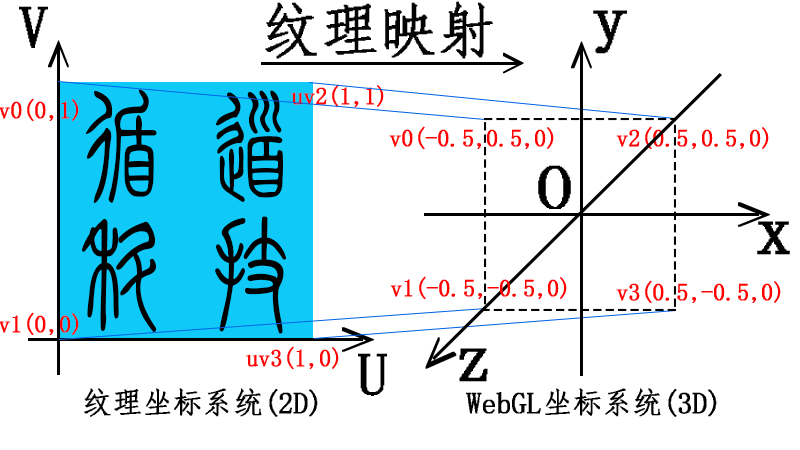

```glsl
attribute vec4 a_Position;//顶点位置坐标
attribute vec2 a_TexCoord;//纹理坐标
varying vec2 v_TexCoord;//插值后纹理坐标
void main() {
  //顶点坐标apos赋值给内置变量gl_Position
  gl_Position = a_Position;
  //纹理坐标插值计算
  v_TexCoord = a_TexCoord;
}
```

```glsl
//所有float类型数据的精度是highp
precision highp float;
// 接收插值后的纹理坐标
varying vec2 v_TexCoord;
// 纹理图片像素数据
uniform sampler2D u_Sampler;
void main() {
  // 采集纹素，逐片元赋值像素值
  gl_FragColor = texture2D(u_Sampler,v_TexCoord);
}
```

```js
/**
 * 从program对象获取相关的变量
 * attribute变量声明的方法使用getAttribLocation()方法
 * uniform变量声明的方法使用getAttribLocation()方法
 **/
var a_Position = gl.getAttribLocation(program, "a_Position");
var a_TexCoord = gl.getAttribLocation(program, "a_TexCoord");
var u_Sampler = gl.getUniformLocation(program, "u_Sampler");

/**
 * 四个顶点坐标数据data，z轴为零
 * 定义纹理贴图在WebGL坐标系中位置
 **/
var data = new Float32Array([
  -0.5,
  0.5, //左上角——v0
  -0.5,
  -0.5, //左下角——v1
  0.5,
  0.5, //右上角——v2
  0.5,
  -0.5, //右下角——v3
]);
/**
 * 创建UV纹理坐标数据textureData
 **/
var textureData = new Float32Array([
  0,
  1, //左上角——uv0
  0,
  0, //左下角——uv1
  1,
  1, //右上角——uv2
  1,
  0, //右下角——uv3
]);
/**
 * 加载纹理图像像素数据
 **/
var image = new Image();
image.src = "texture.jpg"; //设置图片路径
image.onload = texture; //图片加载成功后执行texture函数

/**
 创建缓冲区textureBuffer，传入图片纹理数据，然后执行绘制方法drawArrays()
 **/
function texture() {
  var texture = gl.createTexture(); //创建纹理图像缓冲区
  gl.pixelStorei(gl.UNPACK_FLIP_Y_WEBGL, true); //纹理图片上下反转
  gl.activeTexture(gl.TEXTURE0); //激活0号纹理单元TEXTURE0
  gl.bindTexture(gl.TEXTURE_2D, texture); //绑定纹理缓冲区
  //设置纹理贴图填充方式(纹理贴图像素尺寸大于顶点绘制区域像素尺寸)
  gl.texParameteri(gl.TEXTURE_2D, gl.TEXTURE_MIN_FILTER, gl.LINEAR);
  //设置纹理贴图填充方式(纹理贴图像素尺寸小于顶点绘制区域像素尺寸)
  gl.texParameteri(gl.TEXTURE_2D, gl.TEXTURE_MAG_FILTER, gl.LINEAR);
  //设置纹素格式，jpg格式对应gl.RGB
  gl.texImage2D(gl.TEXTURE_2D, 0, gl.RGB, gl.RGB, gl.UNSIGNED_BYTE, image);
  gl.uniform1i(u_Sampler, 0); //纹理缓冲区单元TEXTURE0中的颜色数据传入片元着色器
  // 进行绘制
  gl.drawArrays(gl.TRIANGLE_STRIP, 0, 4);
}
```

| 纹理参数              | 填充模式 | 默认值                   |
| :-------------------- | :------- | :----------------------- |
| gl.TEXTURE_MAG_FILTER | 纹理放大 | gl.LINEAR                |
| gl.TEXTURE_MIN_FILTER | 纹理缩小 | gl.NEAREST_MIPMAP_LINEAR |
| gl.TEXTURE_WRAP_S     | 水平填充 | gl.REPEAT                |
| gl.TEXTURE_WRAP_T     | 竖直填充 | gl.REPEAT                |

| 值         | 含义                                                                                                       |
| :--------- | :--------------------------------------------------------------------------------------------------------- |
| gl.NEAREST | 纹理坐标乘以纹理图片需要缩放的倍数得到像素的选取坐标，选择坐标对应的像素，多余的舍弃掉                     |
| gl.LINEAR  | 选择纹理坐标对应的像素周围的像素颜色值进行加权平均，相比 gl.NEAREST 的效果更好，付出的代价是更消耗硬件资源 |

| 值                 | 含义                       |
| :----------------- | :------------------------- |
| gl.gl.REPEAT       | 平铺方式                   |
| gl.MIRRORED_REPEAT | 镜像方式                   |
| gl.CLAMP_TO_EDGE   | 绘制区域边缘使用贴图的部分 |

| 格式               | 含义             | 图片格式   |
| :----------------- | :--------------- | :--------- |
| gl.RGB             | 红、绿、蓝三原色 | .JPG、.BMP |
| gl.RGBA            | 三原色+透明度    | .PNG       |
| gl.LUMINANCE       | 流明             | 灰度图     |
| gl.LUMINANCE_ALPHA | 透明度           | 灰度图     |

| 格式                      | 含义                                       |
| :------------------------ | :----------------------------------------- |
| gl.UNSIGNED_BYTE          | 无符号整型，每个颜色分量一个字节长度       |
| gl.UNSIGNED_SHORT_5_6_5   | RGB：RGB 每个分量对应长度 5、6、5 位       |
| gl.UNSIGNED_SHORT_4_4_4_4 | RGBA：RGBA 每个分量对应长度 4 位           |
| gl.UNSIGNED_SHORT_5_5_5_1 | RGBA：RGB 每个分量对应长度 5 位，A 是 1 位 |
