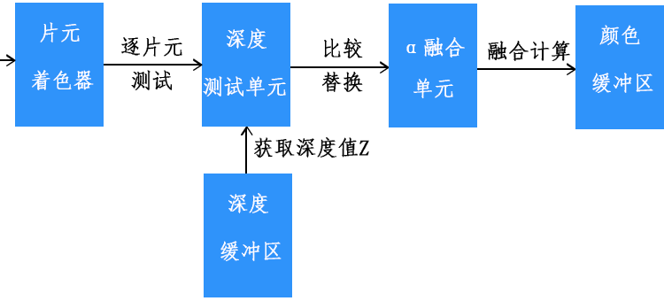

## gl.enable

| 参数                   | 功能                       |
| :--------------------- | :------------------------- |
| gl.DEPTH_TEST          | 深度测试，消除看不到隐藏面 |
| gl.BLEND               | α 融合，实现颜色融合叠加   |
| gl.POLYGON_OFFSET_FILL | 多边形偏移，解决深度冲突   |

## 开启、设置 α 融合

```js
/**
 * 渲染管线α融合功能单元配置
 **/
gl.enable(gl.BLEND);
gl.blendFunc(gl.SRC_ALPHA, gl.ONE_MINUS_SRC_ALPHA);
             // src            target
```

$$
\begin{pmatrix} R_3 \\ G_3 \\ B_3 \end{pmatrix}
= A_1 \begin{pmatrix} R_1 \\ G_1 \\ B_1 \end{pmatrix}
+ (1 - A_1)\begin{pmatrix} R_2 \\ G_2 \\ B_2 \end{pmatrix}
$$

| 参数                   | 红色 R 分量系数 | 绿色 G 分量系数 | 蓝色 B 分量系数 |
| :--------------------- | :-------------- | :-------------- | :-------------- |
| gl.ZERO                | 0               | 0               | 0               |
| gl.ONE                 | 1               | 1               | 1               |
| gl.SRC_COLOR           | Rs              | Gs              | Bs              |
| gl.ONE_MINUS_SRC_COLOR | 1 – Rs          | 1 – Gs          | 1 – Bs          |
| gl.DST_COLOR           | Rd              | Gd              | Bd              |
| gl.ONE_MINUS_DST_COLOR | 1 - Rd          | 1 - Gd          | 1 - Bd          |
| gl.SRC_ALPHA           | As              | As              | As              |
| gl.ONE_MINUS_SRC_ALPHA | 1 - As          | 1 - As          | 1 - As          |
| gl.DST_ALPHA           | Ad              | Ad              | Ad              |
| gl.ONE_MINUS_DST_ALPHA | 1 - Ad          | 1 - Ad          | 1 - Ad          |
| gl.SRC_ALPHA_SATURATE  | min(As, Ad)     | min(As, Ad)     | min(As, Ad)     |

## 深度测试

1. 片元的深度值Z反应的是一个片元距离观察位置的远近
2. 两个顶点之间的片元深度值Z来源与两个顶点z坐标值的插值计算
3. 所有片元的深度值Z都存储在帧缓存的深度缓冲区中。
4. 深度测试单元位于片元着色器之后
5. 开启了深度测试，所有的片元会经过该功能单元的逐片元测试，通过比较片元深度值Z，WebGL图形系统默认沿着Z轴正方向观察， 同一个屏幕坐标位置的所有片元离观察点远的会被舍弃，只保留一个离眼睛近的片元，把它的像素值RGB存储到帧缓存的颜色缓冲区中。 
6. 没有开启深度测试，对于相同屏幕坐标的片元，WebGL会按照片元的绘制顺序覆盖替换
7. 深度测试的过程是片元逐个比较，如果同一个屏幕坐标位置有n个片元那就要比较n-1次，对于复杂的场景往往由多个物体先后排列，如果不透明的话，就会有多层片元叠加， 只有离眼睛近的片元才能被看到。



## alpha融合

